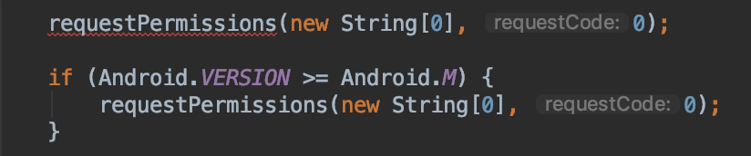

# Android Version

Utility to check Android version at runtime. Saves a few key strokes and **preserves lint checks**:

```java
if (Android.VERSION >= Android.M) {
  // marshmallow :tada:
}
```



---


```groovy
annotationProcessor "io.noties:android:${latestVersion}"
```

Unfortunately in order to preserve lint checks, Android Studio must have code source of an utility that does that. Simply publishing such utility will not have proper lint checks (which kills the idea of such utility in the first place).

This library is implemented via annotation-processor which puts _source_ of `Android.java` in your project generated source files. Please note that `Android.java` will always have `io.noties.android.Android` name. If it's doesn't work for you, you can copy `Android.java` file manually and introduce the checks that you will require (the file is located at the root directory of this repository).

Annotation-processor will try to find `io.noties.android.Android` class, and if it will find it in the classpath of your project - will do nothing. So only one instance of `Android.java` will be present.

Annotation-processor does not require any _set-up_, like a placing an annotation anywhere in your project as it is configured to process `@NonNull` and `@Nullable` annotations from `com.android.support.annotation` and `androidx.annotation` packages.

**Please note** that this library will work as intended (with lint checks) **only if** annotation-processor is added to one of your modules inside one project. If you plan to distribute a module with annotation-processor added via Maven, the consumers of your module will end-up with a _lint-free_ version of this utility. As `Android.java` will be included in the bytecode form and Android Studio won't be able to process it.

## License

```
  Copyright 2019 Dimitry Ivanov (legal@noties.io)

  Licensed under the Apache License, Version 2.0 (the "License");
  you may not use this file except in compliance with the License.
  You may obtain a copy of the License at

      http://www.apache.org/licenses/LICENSE-2.0

  Unless required by applicable law or agreed to in writing, software
  distributed under the License is distributed on an "AS IS" BASIS,
  WITHOUT WARRANTIES OR CONDITIONS OF ANY KIND, either express or implied.
  See the License for the specific language governing permissions and
  limitations under the License.
```

